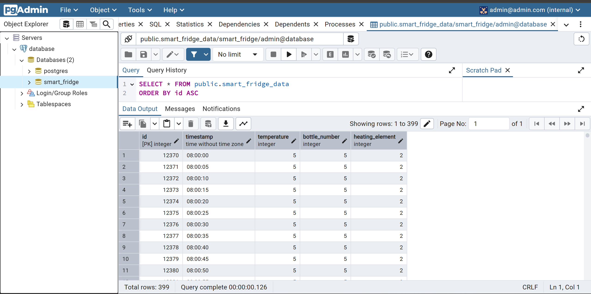
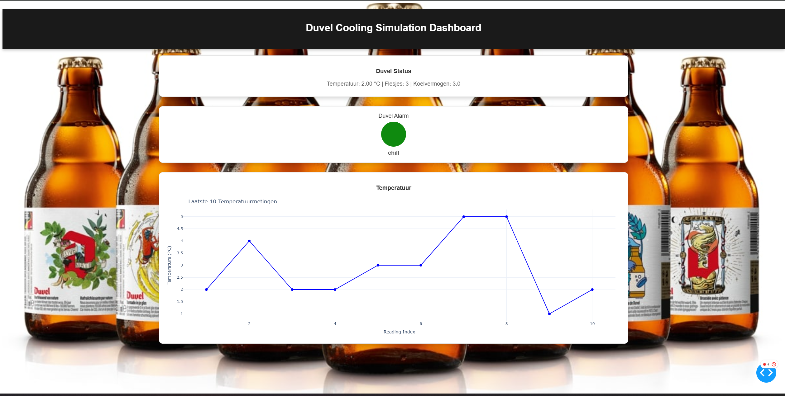

# SmartFridge

Project over het slimmer maken van een koelkast met AI, zodat er meer kostenbesparing is voor de koelmechanismen en elektriciteit.

## Kenmerken
- **AI-Aangedreven Optimalisatie**: Maakt gebruik van AI-algoritmes om de koelcycli te optimaliseren, waardoor het elektriciteitsverbruik wordt verminderd.
- **Kostenbesparing**: Richt zich op kostenbesparing door efficiënt gebruik van de koelmechanismen.
- **Slimme Monitoring**: Houdt de prestaties van de koelkast continu in de gaten en maakt indien nodig aanpassingen.

## Installatie
1. Clone de repository:
   ```bash
   git clone https://github.com/stoofvleesmetpasta/SmartFridge.git
   ```
2. Navigeer naar de projectmap:
   ```bash
   cd SmartFridge
   ```
3. Installeer de vereiste Python-afhankelijkheden:
   ```bash
   pip install -r requirements.txt
   ```

4. **Docker Compose**: Voer het volgende uit om de backend, data preprocessing en CSV-bestanden naar een PostgreSQL-database te pushen:
   ```bash
   docker-compose up
   ```

   Dit zal de Docker-containers starten en ervoor zorgen dat de backend correct functioneert, en de CSV-bestanden in de `Data-process` map worden gelezen en naar de PostgreSQL-database worden gepusht. De PostgreSQL-database kan benaderd worden via pgAdmin op `localhost:5050`.

## Gebruik
1. Voer het hoofdscript uit om de SmartFridge AI te starten:
   ```bash
   python main.py
   ```
   
2. Nadat `main.py` is uitgevoerd, start je het dashboard met het volgende commando om het frontend-dashboard te bekijken:
   ```bash
   python dashboard.py
   ```

3. Volg de aanwijzingen op het scherm om je koelkastinstellingen te configureren en het dashboard te bedienen.

## PostgreSQL & pgAdmin
- De gegevens worden opgeslagen in een PostgreSQL-database.
- Je kunt de gegevens bekijken via pgAdmin door naar `localhost:5050` te navigeren. Zorg ervoor dat je inloggegevens voor de database correct zijn ingesteld.
  
  

## Dashboard
Het dashboard biedt een overzicht van de prestaties van je koelkast en de kostenbesparing die wordt behaald door de AI-optimalisatie.



## Gebruikte Technologieën
- **Python**: De primaire taal voor het ontwikkelen van de AI-algoritmes en besturingslogica.
- **Docker**: Gebruikt voor het containeren van de applicatie om consistente omgevingen te garanderen.
- **PostgreSQL**: Database waarin de gegevens worden opgeslagen.
- **pgAdmin**: Gebruikt om de PostgreSQL-database te beheren en te visualiseren.

## Bijdragen
- Nick
- Lander
- Bers
- Loïc
